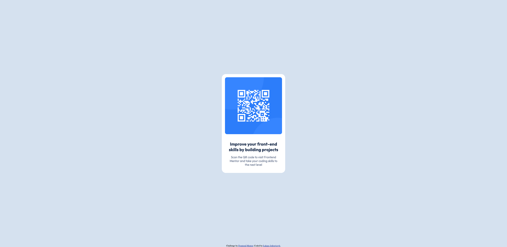

# Frontend Mentor - QR code component solution

This is a solution to the [QR code component challenge on Frontend Mentor](https://www.frontendmentor.io/challenges/qr-code-component-iux_sIO_H). Frontend Mentor challenges help you improve your coding skills by building realistic projects.

## Table of contents

- [Overview](#overview)
  - [Screenshot](#screenshot)
  - [Links](#links)
- [My process](#my-process)
  - [Built with](#built-with)
  - [What I learned](#what-i-learned)
  - [Continued development](#continued-development)
  - [Useful resources](#useful-resources)
- [Author](#author)
- [Acknowledgments](#acknowledgments)

## Overview

### Screenshot

### Links

- Solution URL: [https://github.com/LUKASZ-JK/fem-qrcode](https://github.com/LUKASZ-JK/fem-qrcode)
- Live Site URL: [https://lukasz-jk.github.io/fem-qrcode](https://lukasz-jk.github.io/fem-qrcode)

## My process

### Built with

- Semantic HTML5 markup
- CSS custom properties
- Flexbox
- Mobile-first workflow
- [Sass](https://sass-lang.com/) - CSS with superpowers

### What I learned

This is a first project in which I had the opportunity to learn basics of Sass.

### Continued development

My goal is to eventually learn Bootstrap and Tailwind CSS frameworks to be used in conjunction with React to build web apps.

### Useful resources

- [Adding a footer at the bottom of the page using flexbox](https://pinjarirehan.medium.com/how-to-make-a-sticky-footer-using-flexbox-c99e0edb8209) - This helped me to add the attribution footer that sticks to the bottom of the page.
- [Preventing the Layout Shift Caused by Scrollbars ](https://dev.to/rashidshamloo/preventing-the-layout-shift-caused-by-scrollbars-2flp) - Explanation on how to avoid the content shift when a scrollbar apperas on a smaller screen.

## Author

- Website - [Łukasz Jędrzejczyk](https://github.com/LUKASZ-JK/)
- Frontend Mentor - [@LUKASZ-JK](https://www.frontendmentor.io/profile/LUKASZ-JK)
